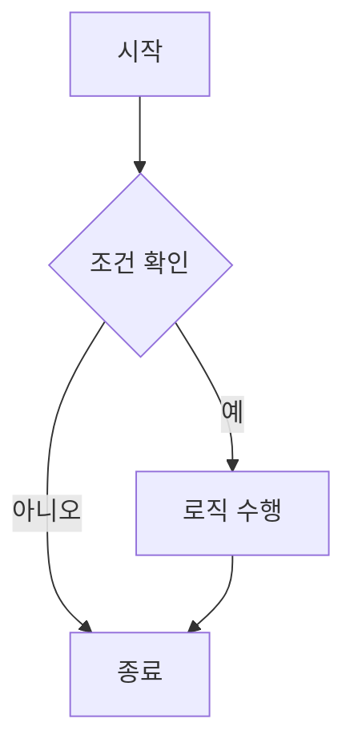

이 포스트는 **Jekyll Chirpy 테마**의 스타일링을 테스트하기 위한 예제 글입니다. 헤더, 텍스트 서식, 코드 하이라이팅, 수식, 테이블 등 다양한 요소를 포함하고 있습니다.

---

## 1. 텍스트 서식 (Text Formatting)

기본적인 텍스트 스타일을 확인합니다.

- **굵은 글씨 (Bold)**
- *기울임 꼴 (Italic)*
- ~~취소선 (Strikethrough)~~
- `인라인 코드 (Inline Code)`
- [링크 테스트 (Link)](https://github.com)
- 각주 테스트입니다.[^1]

---

## 2. 인용구 및 알림 (Blockquotes & Prompts)

### 기본 인용구
> 인생은 자전거를 타는 것과 같다. 균형을 잡으려면 움직여야 한다.
>
> — *알베르트 아인슈타인*

### Chirpy 전용 알림 상자 (Prompts)

> 이것은 **Tip** 상자입니다. 유용한 팁을 적을 때 사용합니다.
{: .prompt-tip }

> 이것은 **Info** 상자입니다. 추가 정보를 제공할 때 사용합니다.
{: .prompt-info }

> 이것은 **Warning** 상자입니다. 주의 사항을 알릴 때 사용합니다.
{: .prompt-warning }

> 이것은 **Danger** 상자입니다. 위험하거나 중요한 경고를 할 때 사용합니다.
{: .prompt-danger }

---

## 3. 목록 (Lists)

### 순서 없는 목록
* 사과
* 배
  * 중첩된 항목 1
  * 중첩된 항목 2
* 포도

### 순서 있는 목록
1. 첫 번째 단계
2. 두 번째 단계
   1. 하위 단계 A
   2. 하위 단계 B
3. 세 번째 단계

### 체크 리스트 (Task List)
- [x] 이미 완료된 작업
- [ ] 해야 할 작업
- [ ] 진행 중인 작업

---

## 4. 코드 블럭 (Code Blocks)

### Python
```python
import os

def hello_world():
    message = "Hello, Chirpy!"
    print(message)
    return True

if __name__ == "__main__":
    hello_world()

```

### JavaScript

```javascript
const toggleTheme = () => {
  const body = document.body;
  if (body.classList.contains('dark')) {
    body.classList.remove('dark');
  } else {
    body.classList.add('dark');
  }
};
console.log("Theme toggled!");

```

### Terminal

```bash
$git clone [https://github.com/cotes2020/jekyll-theme-chirpy.git$](https://github.com/cotes2020/jekyll-theme-chirpy.git$) cd jekyll-theme-chirpy
$ bundle install

```

---

## 5. 수식 (MathJax / KaTeX)

`_config.yml`이나 Front Matter에서 `math: true`가 설정되어 있어야 합니다.

**인라인 수식:** 

**블럭 수식:**

---

## 6. 테이블 (Table)

| 정렬 (Left) | 정렬 (Center) | 정렬 (Right) |
| --- | --- | --- |
| 값 1 | 값 2 | 값 3 |
| 텍스트 | 텍스트 | 텍스트 |
| Long Text | Long Text | Long Text |

---

## 7. 이미지 (Image)

이미지 캡션과 함께 렌더링 테스트:

*Chirpy 테마 목업 이미지*

---

## 8. Mermaid 다이어그램

`mermaid: true`가 설정되어 있어야 합니다.



---

## 마무리

여기까지 마크다운 테스트였습니다.

```

### ✅ 사용 방법
1.  프로젝트의 `_posts` 폴더로 이동합니다.
2.  새 파일을 만들고 이름을 `2026-01-25-test-post.md`로 지정합니다.
3.  위 코드를 복사해서 붙여넣고 저장합니다.
4.  Jekyll 서버(`bundle exec jekyll serve`)가 실행 중이라면 자동으로 빌드되어 블로그 메인에 나타납니다.
